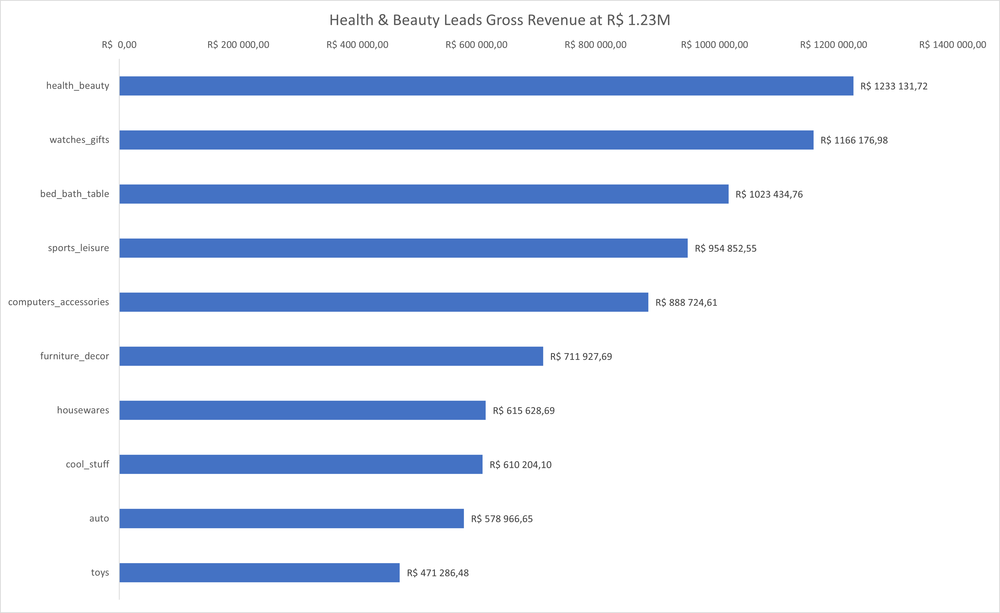
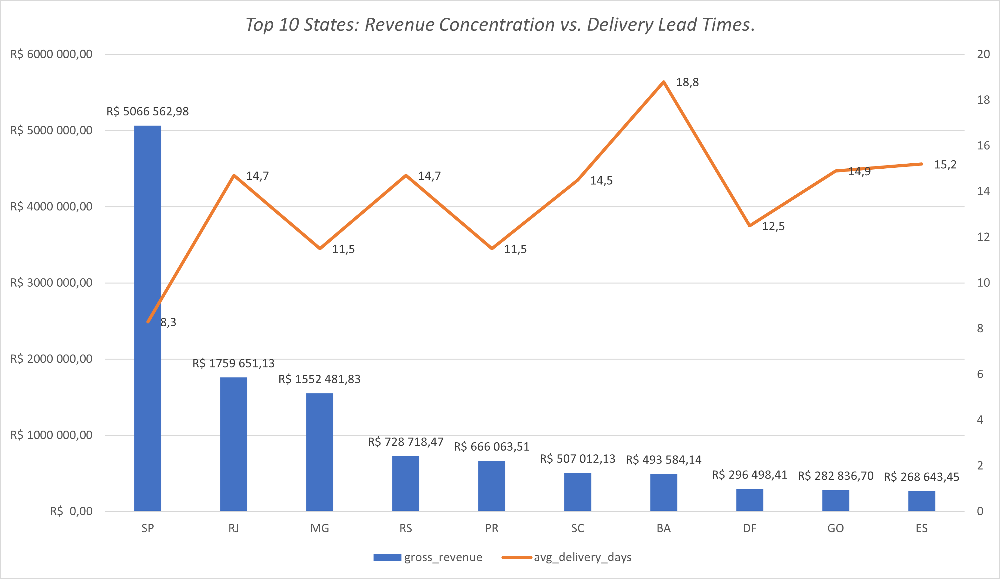
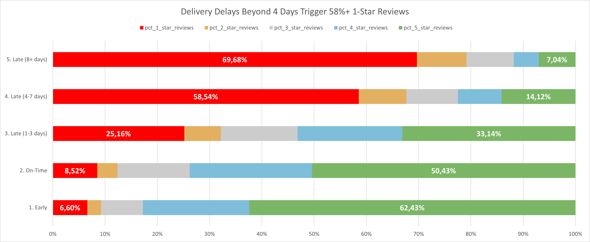

# E-Commerce Sales & Logistics Analysis

A SQL-driven business analytics project exploring how product mix, delivery performance, and customer experience shape e-commerce performance in Brazil.

## Overview
This project analyzes the Olist Brazilian e-commerce dataset to answer three practical business questions:

- Which categories generate the most revenue?
- Which regions struggle most with fulfillment and shipping costs?
- How do delivery delays affect customer satisfaction and review scores?

Using PostgreSQL for analysis and Excel for executive reporting, the project turns raw transactional data into actionable business insights.

## Why this project matters
E-commerce success depends on more than just sales volume. It depends on balancing:

- profitable product categories
- efficient logistics and delivery
- strong customer experience

This project demonstrates how a data analyst can connect operational metrics to business decisions.

## Key Results
- Revenue is concentrated in a small number of high-performing categories.
- Some states generate major revenue but also show significantly longer delivery times and higher freight costs.
- Delivery delays sharply reduce review scores, especially beyond a moderate delay threshold.
- The analysis identifies a clear customer experience risk point where delays begin to damage satisfaction materially.

## Skills Demonstrated
- SQL querying and data aggregation
- Business analysis and KPI interpretation
- Data cleaning and transformation
- Performance and logistics analysis
- Dashboard storytelling and executive reporting

## Tech Stack
- PostgreSQL
- SQL
- Microsoft Excel
- Olist public Brazilian e-commerce dataset

## Repository Structure
```text
├── sql/
│   └── ecommerce_analysis.sql        # SQL analysis for category, logistics, and CSAT
├── dashboard/
│   └── Sales_Logistics_Dashboard.xlsx # Executive Excel dashboard
├── assets/
│   ├── category_performance.png
│   ├── geographic_logistics.png
│   └── logistics_reviews.png
├── README.md
└── .gitignore
```

## Business Questions Answered
### 1. Category Performance
The analysis compares category revenue, order volume, and average order value to identify both high-volume and high-value segments.

### 2. Regional Logistics Efficiency
The project evaluates freight cost and delivery lead time by state to highlight where fulfillment operations are underperforming.

### 3. Customer Satisfaction and Delivery Delays
Order performance is segmented by delay buckets to measure how late deliveries influence review outcomes and customer sentiment.

## SQL Workflow
The SQL analysis includes three core queries:

### Query 1: Category Revenue & AOV
This query cleans translated category names, fills logical missing mappings, and calculates total revenue and average order value.

### Query 2: Regional Fulfillment Analysis
This query summarizes orders by state to assess delivery time, revenue concentration, and freight burden.

### Query 3: Delay vs. Review Score Analysis
This query groups orders by delay performance and analyzes the distribution of 1-star to 5-star reviews.

## Dashboard Snapshot

### Category Performance


### Geographic Logistics


### Delivery Delays & Reviews


## Insights
- Higher-value categories can outperform volume-heavy categories when measured by revenue per order.
- Remote regions suffer from significantly longer shipping cycles and higher transportation costs.
- Review quality declines sharply as delays grow, showing the financial and customer experience impact of fulfillment issues.
- Customer trust begins to decline materially once delivery performance slips beyond expected thresholds.

## Recommended Actions
1. Improve fulfillment in remote and high-cost regions by strengthening local distribution and shipping partnerships.
2. Trigger customer communication and proactive tracking when deliveries begin to exceed expected timing.
3. Prioritize fast, dependable delivery for products with strong margin potential.
4. Use category-level revenue data to allocate marketing spend toward the highest-value segments.

## How to Run
1. Import the Olist dataset into PostgreSQL.
2. Load the required tables such as orders, order_items, customers, products, category_translation, and order_reviews.
3. Run the SQL queries in [sql/ecommerce_analysis.sql](sql/ecommerce_analysis.sql).
4. Open the dashboard in the dashboard folder for the executive summary view.

## Project Impact
This project shows the kind of analytical thinking used in real business environments: it turns raw data into operational recommendations, not just descriptive reporting. It is a practical example of how data analysis can drive better category strategy, logistics decisions, and customer retention outcomes.

## Author
Huseyn

Computer Science Student
